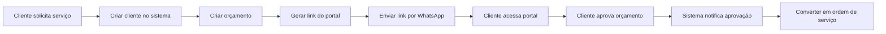
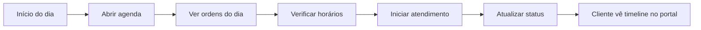

# Portal do Cliente e Agenda - Guia Completo

## 📋 Índice

1. [Portal do Cliente](#portal-do-cliente)
2. [Agenda de Serviços](#agenda-de-serviços)
3. [Fluxo Completo de Uso](#fluxo-completo-de-uso)
4. [Casos de Uso](#casos-de-uso)

---

## 🌐 Portal do Cliente

### O que é?

O Portal do Cliente é uma área pública onde seus clientes podem acessar informações sobre seus serviços **sem precisar criar conta ou fazer login**. O acesso é feito através de um link único e temporário.

### Onde está?

- **URL**: `/portal/[token]`
- **Páginas disponíveis**:
  - `/portal/[token]` - Início (visão geral)
  - `/portal/[token]/quotations` - Lista de orçamentos
  - `/portal/[token]/quotations/[id]` - Detalhes e aprovação de orçamento
  - `/portal/[token]/orders` - Ordens de serviço
  - `/portal/[token]/orders/[id]` - Detalhes da ordem
  - `/portal/[token]/history` - Histórico de serviços

### Como gerar acesso ao portal?

#### Opção 1: Pelo Frontend (Recomendado)

1. Acesse a página de detalhes do cliente: `/dashboard/customers/[id]`
2. Clique no botão **"Gerar Link do Portal"** (verde, com ícone de link externo)
3. Um modal será exibido com:
   - Link completo do portal
   - Botão para copiar o link
   - Data de expiração (7 dias)
   - Instruções de uso
   - Botão para testar o portal

4. Copie o link e compartilhe com o cliente por:
   - Email
   - WhatsApp
   - SMS
   - Qualquer outro canal seguro

#### Opção 2: Pela API

```bash
POST /api/v1/portal/generate-token/:customerId
Authorization: Bearer {seu_jwt_token}

# Resposta
{
  "token": "abc123xyz...",
  "portalUrl": "http://localhost:3001/portal/abc123xyz...",
  "expiresIn": "7 days"
}
```

### Segurança

- ✅ Token válido por **7 dias**
- ✅ Autenticação via header `X-Customer-Token`
- ✅ Cliente só vê seus próprios dados (isolamento por tenant + customer)
- ✅ Não requer criação de conta
- ✅ Link pessoal e intransferível

### O que o cliente pode fazer no portal?

#### 1. Visualizar e Aprovar Orçamentos

- Ver lista de todos os orçamentos
- Filtrar por status (pendente, aprovado, rejeitado)
- Abrir detalhes de cada orçamento:
  - Número do orçamento (ex: QT-2024-001)
  - Data de validade
  - Lista completa de serviços e valores
  - Total
  - Observações
- **Aprovar** orçamento com um clique
- **Rejeitar** orçamento se necessário
- Status atualiza em tempo real

#### 2. Acompanhar Ordens de Serviço

- Ver todas as ordens em andamento
- Ver status atual:
  - Aberta
  - Agendada
  - Em andamento
  - Concluída
  - Cancelada
- Visualizar timeline de eventos:
  - "Ordem criada"
  - "Ordem agendada para [data]"
  - "Técnico iniciou o serviço"
  - "Serviço concluído"
- Ver data de agendamento
- Ver itens/serviços incluídos

#### 3. Consultar Histórico

- Lista completa de serviços já realizados
- Informações incluem:
  - Número da ordem
  - Data de conclusão
  - Serviços executados
  - Resumo estatístico:
    - Total de serviços
    - Data do primeiro serviço
    - Data do último serviço

---

## 📅 Agenda de Serviços

### O que é?

Sistema de calendário visual para gerenciar agendamentos de ordens de serviço, permitindo visualização por mês, semana ou dia.

### Onde está?

- **Acesso**: Menu lateral → "Agenda"
- **URL**: `/dashboard/schedule`
- **Ícone**: Calendário

### Componentes Disponíveis

#### 1. Calendário Principal (react-big-calendar)

**Arquivo**: `apps/web/src/app/dashboard/schedule/page.tsx`

**Recursos**:
- Visualização por **Mês, Semana, Dia ou Agenda**
- Eventos coloridos por status:
  - 🔵 Azul: Agendado
  - 🟠 Laranja: Em andamento
  - 🟢 Verde: Concluído
- Clique em evento → Abre detalhes da ordem
- Clique em horário vazio → Criar nova ordem (em desenvolvimento)
- Navegação entre períodos (anterior/próximo/hoje)
- Localização em português

**Como usar**:
```typescript
// Eventos são carregados automaticamente das ordens agendadas
const events = orders.map(order => ({
  id: order.id,
  title: `${order.number} - ${order.customer.name}`,
  start: new Date(order.scheduledFor),
  end: new Date(order.scheduledFor + 1 hour),
  resource: order
}));
```

#### 2. Calendário Semanal Customizado

**Arquivo**: `apps/web/src/components/Calendar/WeekCalendar.tsx`

**Recursos**:
- Visão de **7 dias** completos
- Horário comercial: **8h às 18h**
- Grid com slots de 1 hora
- Destaque visual do dia atual
- Múltiplas ordens no mesmo horário (empilhadas)
- Cards compactos com:
  - Número da OS
  - Nome do cliente
  - Status visual

**Como usar**:
```tsx
import WeekCalendar from '@/components/Calendar/WeekCalendar';

<WeekCalendar
  orders={scheduledOrders}
  onOrderClick={(order) => router.push(`/dashboard/orders/${order.id}`)}
  onSlotClick={(date, hour) => console.log('Criar ordem em', date, hour)}
/>
```

### Endpoints da API de Agendamento

**Arquivo**: `apps/web/src/lib/api/scheduling.ts`

```typescript
// 1. Buscar agendamentos do dia
schedulingApi.getDaySchedule(technicianId, '2024-03-16')

// 2. Buscar agendamentos da semana
schedulingApi.getWeekSchedule(technicianId, '2024-03-11')

// 3. Verificar disponibilidade
schedulingApi.checkAvailability(technicianId, '2024-03-16T14:00:00', duration)

// 4. Buscar slots disponíveis
schedulingApi.getAvailableSlots(technicianId, '2024-03-16', count)

// 5. Estatísticas
schedulingApi.getStats(technicianId)
// Retorna: { today, thisWeek, upcoming }
```

### Como agendar uma ordem?

#### Opção 1: Ao criar a ordem

1. Vá para `/dashboard/orders/new`
2. Preencha os dados da ordem
3. Marque "Agendar"
4. Selecione data e hora
5. Salve

#### Opção 2: Editar ordem existente

1. Abra os detalhes da ordem
2. Clique em "Editar"
3. Altere o campo `scheduledFor`
4. Salve

#### Opção 3: Pela agenda (em desenvolvimento)

1. Abra `/dashboard/schedule`
2. Clique em um horário vazio
3. Modal para criar ordem naquele horário

---

## 🔄 Fluxo Completo de Uso

### Cenário 1: Cliente solicita orçamento



**Passo a passo detalhado**:

1. **Cadastrar cliente** (se novo):
   - `/dashboard/customers/new`
   - Preencher nome, contatos, endereço

2. **Criar orçamento**:
   - `/dashboard/quotations/new`
   - Selecionar cliente
   - Adicionar serviços
   - Definir validade
   - Salvar

3. **Gerar link do portal**:
   - Abrir `/dashboard/customers/[id]`
   - Clicar "Gerar Link do Portal"
   - Copiar link gerado

4. **Compartilhar com cliente**:
   - Enviar por WhatsApp: "Olá! Aqui está o link para você ver e aprovar o orçamento: [link]"

5. **Cliente acessa e aprova**:
   - Cliente clica no link
   - Vê orçamento
   - Clica em "Aprovar Orçamento"

6. **Converter em ordem**:
   - Você recebe notificação de aprovação
   - Vai em `/dashboard/quotations/[id]`
   - Clica "Converter em Ordem de Serviço"

7. **Agendar execução**:
   - Vai em `/dashboard/schedule`
   - Seleciona data/hora
   - Agenda a ordem

8. **Cliente acompanha**:
   - Cliente usa o mesmo link do portal
   - Vai em "Ordens de Serviço"
   - Vê status em tempo real

### Cenário 2: Agendar serviço do dia



**Passo a passo**:

1. **Visualizar agenda do dia**:
   - Abrir `/dashboard/schedule`
   - Alternar para visualização "Dia"
   - Ver todas ordens agendadas

2. **Conferir detalhes**:
   - Clicar em evento
   - Ver cliente, endereço, serviços

3. **Iniciar atendimento**:
   - Abrir ordem
   - Clicar "Iniciar Serviço"
   - Status muda para "Em andamento"

4. **Cliente vê atualização**:
   - Cliente acessa portal
   - Vê timeline: "Técnico iniciou o serviço às 14:23"

5. **Concluir serviço**:
   - Marcar checklists
   - Adicionar fotos
   - Clicar "Concluir"

6. **Cliente é notificado**:
   - Email/SMS: "Seu serviço foi concluído!"
   - Portal mostra status "Concluído"

---

## 💡 Casos de Uso

### Quando gerar link do portal?

✅ **Deve gerar**:
- Cliente precisa aprovar orçamento remotamente
- Cliente quer acompanhar ordem em andamento
- Cliente solicita histórico de serviços
- Primeiro contato com cliente novo
- Cliente prefere acompanhamento digital

❌ **Não precisa gerar**:
- Cliente está presencialmente na sua loja
- Orçamento já foi aprovado verbalmente
- Serviço é emergencial e não precisa aprovação

### Quando usar cada visualização da agenda?

#### Visualização Mensal
- **Use quando**: Planejar o mês inteiro
- **Bom para**: Ver densidade de agendamentos, identificar dias livres
- **Exemplo**: "Preciso ver se tenho disponibilidade na próxima semana"

#### Visualização Semanal
- **Use quando**: Planejar a semana de trabalho
- **Bom para**: Organizar rotas de atendimento, equilibrar carga
- **Exemplo**: "Vou ver quais clientes posso atender em sequência"

#### Visualização Diária
- **Use quando**: Executar o dia a dia
- **Bom para**: Ver horários exatos, checklist do dia
- **Exemplo**: "Qual é meu próximo atendimento?"

#### Visualização Agenda (Lista)
- **Use quando**: Precisa de visão detalhada
- **Bom para**: Ver informações completas sem clicar
- **Exemplo**: "Preciso dos telefones de todos os clientes da semana"

### Dicas de Produtividade

1. **Portal**:
   - Gere o link assim que criar o orçamento
   - Já envie junto com a mensagem inicial
   - Reutilize o mesmo link (válido por 7 dias)

2. **Agenda**:
   - Comece o dia na visualização "Dia"
   - Use cores para identificar prioridades
   - Configure notificações de agendamentos

3. **Integração**:
   - Aprovação no portal → Converta em ordem → Agende
   - Use o histórico do portal para mostrar confiabilidade
   - Timeline automática no portal reduz ligações de clientes

---

## 🚀 Próximos Passos

### Em desenvolvimento

- [ ] Criar ordem direto do calendário (clique em slot vazio)
- [ ] Notificações automáticas por email/SMS quando:
  - Orçamento é enviado
  - Ordem é agendada
  - Técnico inicia serviço
  - Serviço é concluído
- [ ] Filtro por técnico na agenda
- [ ] Visão de múltiplos técnicos (grid)
- [ ] Arrastar e soltar para reagendar

### Melhorias planejadas

- [ ] QR Code no modal do portal (escanear e abrir)
- [ ] WhatsApp Web integration (enviar link direto)
- [ ] Chatbot no portal para FAQ
- [ ] Rating/avaliação após conclusão
- [ ] Galeria de fotos antes/depois no portal

---

## 📚 Arquivos Importantes

### Backend
- `apps/api/src/modules/customer-portal/customer-portal.controller.ts` - Endpoints do portal
- `apps/api/src/modules/customer-portal/customer-portal.service.ts` - Lógica do portal
- `apps/api/src/modules/scheduling/scheduling.controller.ts` - Endpoints de agendamento

### Frontend - Portal
- `apps/web/src/app/portal/[token]/` - Páginas do portal
- `apps/web/src/lib/api/customer-portal.ts` - API client do portal
- `apps/web/src/components/portal/PortalLayout.tsx` - Layout do portal

### Frontend - Agenda
- `apps/web/src/app/dashboard/schedule/page.tsx` - Página principal
- `apps/web/src/components/Calendar/WeekCalendar.tsx` - Calendário semanal
- `apps/web/src/lib/api/scheduling.ts` - API client de agendamento

### Frontend - Integração Portal
- `apps/web/src/app/dashboard/customers/[id]/page.tsx` - Botão gerar link
- `apps/web/src/components/customers/PortalLinkModal.tsx` - Modal do link
- `apps/web/src/lib/api/customers.ts` - Função generatePortalToken

---

## ❓ FAQ

**P: O link do portal expira?**
R: Sim, após 7 dias. Gere um novo link se necessário.

**P: O cliente precisa criar conta?**
R: Não! O acesso é direto pelo link.

**P: Posso revogar um link?**
R: Atualmente não. Planejado para próxima versão.

**P: Quantos técnicos posso ter na agenda?**
R: Atualmente a visualização é unificada. Filtro por técnico está em desenvolvimento.

**P: Como o cliente sabe que tem orçamento para aprovar?**
R: Você deve enviar o link junto com uma mensagem. Notificações automáticas estão planejadas.

**P: Posso personalizar o portal com minha marca?**
R: Atualmente não. Planejado para versão enterprise.

---

**Dúvidas ou sugestões? Entre em contato ou abra uma issue no GitHub!**
